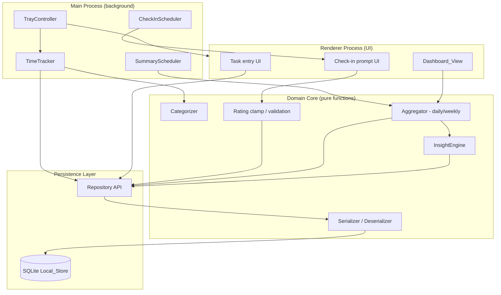

# Design Document

## Overview

The Hybrid Productivity Dashboard is a privacy-focused, offline-first desktop application that runs from the system tray. It automatically tracks the active window, lets users categorize that activity (Work / Break / Distraction / Uncategorized), records manual task entries, prompts for periodic energy/focus check-ins, and produces a daily summary notification plus an on-demand weekly report with locally generated insights. All data is stored on-device and every core function works without a network connection.

The design follows a layered architecture that deliberately starts simple and isolates each capability behind a narrow interface, so features can be added incrementally without rewiring the system. The most valuable correctness logic — categorization, rating clamping, time accumulation, report aggregation, and persistence (de)serialization — is implemented as **pure, side-effect-free functions** that take data in and return data out. This keeps the platform-coupled pieces (OS tray, active-window polling, notifications, file I/O) thin and pushes the testable behavior into a deterministic core that is ideal for property-based testing.

### Technology Choices and Rationale

| Concern | Choice | Rationale |
|---|---|---|
| Runtime / platform | **Electron + TypeScript** | Cross-platform tray support (Windows/macOS/Linux), mature native notifications, single language for core + UI. Keeps the "start simple, grow incrementally" goal achievable. |
| Active window detection | **`active-win`** npm package | Provides app name + window title cross-platform without bespoke native code. |
| Local storage | **SQLite via `better-sqlite3`** | Embedded, file-based, fully offline, synchronous (simple control flow), supports efficient date-range queries needed by the dashboard and reports. |
| Charts / dashboard | Renderer process (HTML/CSS + a charting lib such as Chart.js) | Renders locally; no external calls. |
| Property-based testing | **`fast-check`** (with the project's unit runner, e.g. Vitest/Jest) | Mature TS PBT library; we will not implement PBT from scratch. |

> Research note: `active-win` and `better-sqlite3` are established, widely-used libraries that operate entirely on-device, which satisfies the local-only and offline requirements (Requirements 9 and 10). System idle detection is available cross-platform through Electron's `powerMonitor.getSystemIdleTime()`, which the Time_Tracker uses for idle detection (Requirement 1.4). Content was rephrased for compliance with licensing restrictions.

## Architecture

The application is split into three Electron layers plus a deterministic domain core:



### Architectural Principles

1. **Pure core, thin shell.** OS interactions (tray, polling, notifications, disk) live in the Main process and Persistence layer. All decision logic (categorization, clamping, aggregation, insight text, serialization) is pure and dependency-injected, so it can be tested without an OS or a database.
2. **Repository abstraction.** Components never touch SQLite directly; they call a `Repository` interface. This allows the persistence backend to evolve and makes the domain core testable against an in-memory implementation.
3. **Incremental growth.** Each requirement maps to one component behind a stable interface. New capabilities (e.g., more report types) attach to the Repository and Aggregator without altering existing components.
4. **Offline by construction.** No component performs network I/O. The Insight_Engine is rule/statistics based and runs locally, so offline operation (Requirement 10) and on-device processing (Requirement 9.4) are guaranteed by design.

## Components and Interfaces

### TrayController (Requirement 8)
Owns the tray icon and menu. Exposes controls to open the Dashboard_View, log a task, and enable/disable tracking. Holds the tracking-enabled flag, which defaults to **disabled** on every startup (Requirement 8.5).

```typescript
interface TrayController {
  showIcon(): void;
  buildMenu(): TrayMenu; // open dashboard, log task, enable/disable tracking
  setTrackingEnabled(enabled: boolean): void;
  isTrackingEnabled(): boolean;
}
```

### TimeTracker (Requirement 1, 8.3, 8.4, 10.1)
Polls the active window at an interval `<= 5s`. Maintains the in-progress Activity_Record, accumulates duration while the window is unchanged, splits a record when the window changes, and applies idle detection.

```typescript
interface TimeTracker {
  enabled: boolean;
  poll(now: Date, active: ActiveWindow, systemIdleSeconds: number): TrackerState;
  // returns possibly-completed ActivityRecord(s) to persist + updated current record
}

interface ActiveWindow { appName: string; windowTitle: string; }

interface TrackerState {
  current: ActivityRecord | null;
  completed: ActivityRecord[]; // records ready to persist
}
```

The accumulation/split/idle logic is a pure function of `(previousState, now, active, systemIdleSeconds, idleThresholdSeconds)`.

### Categorizer (Requirement 2)
Maps an application name to a Category using user-defined rules; falls back to `Uncategorized`. Applying or changing rules re-derives categories for affected records.

```typescript
type Category = 'Work' | 'Break' | 'Distraction' | 'Uncategorized';

interface Categorizer {
  categorize(appName: string, rules: CategoryRule[]): Category;
  applyRulesToRecords(records: ActivityRecord[], rules: CategoryRule[]): ActivityRecord[];
}

interface CategoryRule { appName: string; category: Category; }
```

### TaskLogger (Requirement 3, 10.2)
Validates and persists task entries; supports edit and delete. Empty/whitespace-only descriptions are rejected.

```typescript
interface TaskLogger {
  add(description: string, now: Date): Result<TaskEntry, ValidationError>;
  edit(id: string, description: string): Result<TaskEntry, ValidationError>;
  delete(id: string): void;
}
```

### CheckInScheduler (Requirement 4, 10.3)
Schedules three daily prompts at configurable times, reissues a skipped prompt once after 30 minutes, and persists submitted entries after clamping ratings to 1–5.

```typescript
interface CheckInScheduler {
  scheduledPrompts(times: TimeOfDay[]): ScheduledPrompt[];
  onSubmit(energy: number, focus: number, now: Date): CheckInEntry; // ratings clamped
  onDismiss(prompt: ScheduledPrompt, now: Date): ScheduledPrompt; // marks skipped + +30min reissue
}
```

### Aggregator (Requirements 5, 6, 7)
Pure functions that build the Daily_Summary, Weekly_Report figures, and dashboard date-range groupings from raw records.

```typescript
interface Aggregator {
  dailySummary(date: CalendarDate, data: DayData): DailySummary;
  weeklyFigures(range: DateRange, data: PeriodData): WeeklyFigures;
  timeByCategory(records: ActivityRecord[], range: DateRange): Record<Category, number>;
}
```

### InsightEngine (Requirement 6.3, 6.4, 6.5, 9.4)
Generates at least one textual insight from local data only; emits an insufficient-data statement when fewer than two days of data exist.

```typescript
interface InsightEngine {
  generate(period: PeriodData): string[]; // length >= 1 always
}
```

### SummaryScheduler (Requirement 5)
Fires at the configured end-of-day time, asks the Aggregator for a Daily_Summary, and shows a notification (including a "no activity recorded" notification when the day is empty).

### Repository / Local_Store (Requirements 9, 11)
Single gateway to SQLite. Handles load-on-startup, missing-file creation, corruption backup + recreate, and export/delete-all.

```typescript
interface Repository {
  init(): InitResult; // created | loaded | recovered | no-persistence
  saveActivity(r: ActivityRecord): void;
  saveTask(t: TaskEntry): void;
  saveCheckIn(c: CheckInEntry): void;
  queryActivities(range: DateRange): ActivityRecord[];
  queryTasks(range: DateRange): TaskEntry[];
  queryCheckIns(range: DateRange): CheckInEntry[];
  exportAll(filePath: string): void;
  deleteAll(): void;
}

type InitResult = 'created' | 'loaded' | 'recovered' | 'no-persistence';
```

### DashboardView (Requirement 7)
Renderer-side view that requests aggregated data for a selected date range and renders time-by-category, the task list, and energy/focus ratings; re-requests data when the range changes.

## Data Models

```typescript
// Category label
type Category = 'Work' | 'Break' | 'Distraction' | 'Uncategorized';

// Requirement 1, 2
interface ActivityRecord {
  id: string;
  appName: string;
  windowTitle: string;
  startTime: string;        // ISO 8601
  durationSeconds: number;  // accumulated active seconds, >= 0
  category: Category;
  isIdle: boolean;
}

// Requirement 2
interface CategoryRule {
  appName: string;          // matched case-insensitively
  category: Category;       // never 'Uncategorized' as a rule target
}

// Requirement 3
interface TaskEntry {
  id: string;
  description: string;      // non-empty, non-whitespace-only
  timestamp: string;        // ISO 8601
}

// Requirement 4
interface CheckInEntry {
  id: string;
  energy: number;           // integer 1..5 after clamping
  focus: number;            // integer 1..5 after clamping
  timestamp: string;        // ISO 8601
  skipped: boolean;         // true when prompt dismissed without submission
}

// Requirement 4, 5, 8 settings
interface Settings {
  checkInTimes: TimeOfDay[];     // exactly 3, configurable
  endOfDayTime: TimeOfDay;
  idleThresholdSeconds: number;  // default 300 (5 minutes)
  pollIntervalSeconds: number;   // <= 5
}

// Requirement 5
interface DailySummary {
  date: string;                              // calendar day
  timeByCategory: Record<Category, number>;  // seconds per category
  completedTaskCount: number;
  averageEnergy: number | null;              // null when no check-ins
  averageFocus: number | null;
  empty: boolean;                            // true when no data for the day
}

// Requirement 6
interface WeeklyReport {
  startDate: string;
  endDate: string;
  timeByCategory: Record<Category, number>;
  completedTaskCount: number;
  energyTrend: number[];   // per-day average energy
  focusTrend: number[];    // per-day average focus
  insights: string[];      // length >= 1
}

interface DateRange { start: string; end: string; } // inclusive calendar days
```

### Storage Schema (SQLite)

- `activities(id, app_name, window_title, start_time, duration_seconds, category, is_idle)`
- `tasks(id, description, timestamp)`
- `check_ins(id, energy, focus, timestamp, skipped)`
- `category_rules(app_name PRIMARY KEY, category)`
- `settings(key PRIMARY KEY, value)`

Indexes on `start_time` / `timestamp` columns support efficient date-range queries for the dashboard and reports.


## Correctness Properties

*A property is a characteristic or behavior that should hold true across all valid executions of a system — essentially, a formal statement about what the system should do. Properties serve as the bridge between human-readable specifications and machine-verifiable correctness guarantees.*

The following properties were derived from the acceptance criteria via the testability prework. Architectural/no-network guarantees (Requirements 6.5, 9.1, 9.4, 10.1–10.4), trigger timing (1.1, 5.1), OS notifications/tray (5.3, 8.1), and one-off startup branches (11.2–11.4) are validated by smoke/integration/example tests instead and are therefore not listed as properties.

### Property 1: Time accumulation and window split

*For any* sequence of polls in which the active window stays the same, the current Activity_Record's accumulated `durationSeconds` equals the sum of the elapsed intervals between those polls; and *for any* poll where the active window changes (app name or window title), a completed Activity_Record is emitted carrying the previous window's `appName`, `windowTitle`, and `startTime`.

**Validates: Requirements 1.2, 1.3**

### Property 2: Idle threshold detection

*For any* poll where the reported system idle time is greater than or equal to the configured idle threshold, the current Activity_Record is marked `isIdle = true` and its `durationSeconds` does not increase while idle; if idle time is below the threshold, the record is not marked idle.

**Validates: Requirements 1.4**

### Property 3: Categorization by rule with fallback

*For any* application name and any set of category rules, `categorize` returns the category of the matching rule when one exists, and returns `Uncategorized` when no rule matches.

**Validates: Requirements 2.1, 2.2**

### Property 4: Rule application to records

*For any* set of Activity_Records and any set of category rules, after `applyRulesToRecords`, every record whose `appName` matches a rule carries that rule's category, and every record whose `appName` matches no rule carries `Uncategorized`.

**Validates: Requirements 2.3**

### Property 5: Valid task is persisted with its description preserved

*For any* description string that contains at least one non-whitespace character, adding it succeeds and the stored Task_Entry's `description` equals the input description.

**Validates: Requirements 3.1**

### Property 6: Whitespace-only tasks are rejected

*For any* string composed entirely of whitespace (including the empty string), adding it is rejected, no Task_Entry is persisted, and the stored task set is unchanged.

**Validates: Requirements 3.2**

### Property 7: Task deletion invariant

*For any* set of persisted tasks and any subset selected for deletion, after deletion the store contains exactly the tasks that were not selected.

**Validates: Requirements 3.3**

### Property 8: Check-in scheduling

*For any* configuration of three check-in times, `scheduledPrompts` produces exactly three prompts whose times equal the configured times.

**Validates: Requirements 4.1, 4.3**

### Property 9: Dismissed check-in is skipped and reissued once

*For any* prompt dismissed at time `t` without submission, the prompt is recorded as skipped and exactly one reissue is produced scheduled at `t + 30 minutes`.

**Validates: Requirements 4.4**

### Property 10: Rating clamping

*For any* integer energy and focus values, the persisted Check_In_Entry ratings lie within `[1, 5]`; values already within range are unchanged; values below 1 become 1 and values above 5 become 5; and clamping is idempotent (`clamp(clamp(x)) == clamp(x)`).

**Validates: Requirements 4.5**

### Property 11: Daily summary aggregation

*For any* set of a single day's Activity_Records, Task_Entry records, and Check_In_Entry records, the Daily_Summary's per-category time equals the sum of the durations of records in that category, its `completedTaskCount` equals the number of tasks, and its `averageEnergy`/`averageFocus` equal the arithmetic means of the day's check-in ratings (or `null` when there are none), with `empty = true` exactly when there is no data for the day.

**Validates: Requirements 5.2, 5.4**

### Property 12: Weekly aggregation and trends

*For any* seven-day period of data, the Weekly_Report's per-category time and task count equal the totals over the period, and the `energyTrend`/`focusTrend` arrays have one entry per day equal to that day's average rating.

**Validates: Requirements 6.2**

### Property 13: Weekly report range filtering

*For any* set of records spanning arbitrary dates, only records whose timestamps fall within the inclusive seven-day reporting period contribute to the Weekly_Report.

**Validates: Requirements 6.1**

### Property 14: At least one insight always produced

*For any* period of data, including an empty period with zero days of data, the Insight_Engine returns at least one textual insight.

**Validates: Requirements 6.3**

### Property 15: Insufficient-data statement

*For any* period containing fewer than two distinct days of recorded data, the Insight_Engine's output includes an insufficient-data statement.

**Validates: Requirements 6.4**

### Property 16: Dashboard category grouping over a range

*For any* set of Activity_Records and any date range, the dashboard's time-by-category grouping equals, for each category, the summed duration of in-range records of that category, and excludes all out-of-range records.

**Validates: Requirements 7.1**

### Property 17: Date-range filtering is a deterministic function of the range

*For any* dataset and any date range, querying tasks and check-ins for that range returns exactly the records whose timestamps fall within the range; querying again with a different range returns exactly that range's records (output depends only on the requested range).

**Validates: Requirements 7.2, 7.3, 7.4**

### Property 18: Tracking gate

*For any* sequence of polls, completed Activity_Records are produced if and only if tracking is enabled.

**Validates: Requirements 8.3, 8.4**

### Property 19: Export round-trip

*For any* complete dataset of Activity_Records, Task_Entry records, and Check_In_Entry records, exporting (serializing) and then re-importing (deserializing) yields a dataset deeply equal to the original.

**Validates: Requirements 9.2**

### Property 20: Delete-all clears the store

*For any* prior contents of the Local_Store, after `deleteAll` every query for activities, tasks, and check-ins returns an empty result.

**Validates: Requirements 9.3**

### Property 21: Persistence round-trip across restart

*For any* set of Activity_Records, Task_Entry records, and Check_In_Entry records, persisting them and then reloading the Local_Store (as on application restart) returns data equal to what was persisted.

**Validates: Requirements 11.1, 1.5, 4.2, 3.4**

## Error Handling

| Scenario | Requirement | Handling |
|---|---|---|
| Missing Local_Store file at startup | 11.2 | `Repository.init()` creates a new empty SQLite store, returns `created`, and the app continues. |
| Corrupted Local_Store file at startup | 11.3 | The corrupted file is renamed to a timestamped backup (e.g. `store.corrupt-<ISO>.bak`), a new empty store is created, `init()` returns `recovered`. |
| Store creation fails (disk full / permissions) | 11.4 | `init()` returns `no-persistence`; the app runs in memory-only mode and notifies the User that data will not be saved. |
| Empty task description submitted | 3.2 | `TaskLogger.add` returns a `ValidationError`; nothing is persisted; the UI shows a validation message. |
| Rating outside 1–5 submitted | 4.5 | Ratings are clamped to the nearest valid value before persistence; no error surfaced. |
| Active-window read fails / no active window | 1.1, 1.2 | The poll is treated as no-change for that interval; no record is corrupted; tracking resumes on the next successful poll. |
| Empty day at end-of-day | 5.4 | A Daily_Summary with `empty = true` is generated and a "no activity recorded" notification is shown. |
| Insight generation with little/no data | 6.3, 6.4 | The engine always returns at least one insight and adds an insufficient-data statement when fewer than two data-days exist. |
| Export target not writable | 9.2 | Export fails gracefully with a user-facing error; stored data is unaffected. |

All error paths preserve the privacy/offline guarantees: no error reporting leaves the device.

## Testing Strategy

### Dual Approach

- **Property-based tests** verify the 21 universal properties above across many generated inputs. They target the pure domain core (TimeTracker step logic, Categorizer, clamping, Aggregator, InsightEngine, serializer) and the Repository exercised against an in-memory/temp-file backend.
- **Unit (example) tests** cover specific scenarios and edge branches: task category change (2.4), tray menu contents (8.2), startup default tracking disabled (8.5), and the startup branches for missing/corrupted/uncreatable stores (11.2–11.4).
- **Integration tests** cover OS-coupled behavior with 1–3 representative examples: poll cadence (1.1), end-of-day trigger (5.1), and notification dispatch (5.3).
- **Smoke tests** cover one-time/architectural guarantees: tray icon creation (8.1), and the no-network/offline + local-only guarantees (6.5, 9.1, 9.4, 10.1–10.4) by asserting no network client is wired into the components and that core flows succeed with networking disabled.

### Property-Based Testing Configuration

- Library: **`fast-check`**, run with the project's test runner. We will not implement PBT from scratch.
- Each property-based test runs a **minimum of 100 iterations**.
- Each property-based test is tagged with a comment referencing its design property using the format:
  `// Feature: productivity-dashboard, Property {number}: {property_text}`
- Generators of note:
  - Poll sequences: arrays of `(timestamp, ActiveWindow, systemIdleSeconds)` with monotonic timestamps, used for Properties 1, 2, 18.
  - Category rule sets + app names (including names absent from the rule set) for Properties 3, 4.
  - Strings including whitespace-only and Unicode for Properties 5, 6.
  - Integers spanning well outside 1–5 (including boundary values 0, 1, 5, 6) for Property 10.
  - Datasets spanning many calendar dates for the aggregation, filtering, and round-trip properties (11, 12, 13, 16, 17, 19, 20, 21), including empty datasets for Properties 11, 14, 15.

### Coverage Mapping

Every testable acceptance criterion maps to at least one property (see **Validates** annotations) or to a named unit/integration/smoke test above, ensuring all 11 requirements are exercised.
